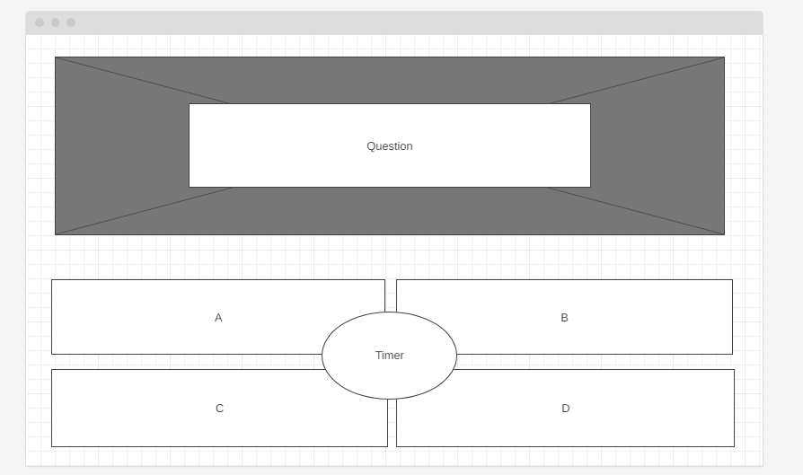
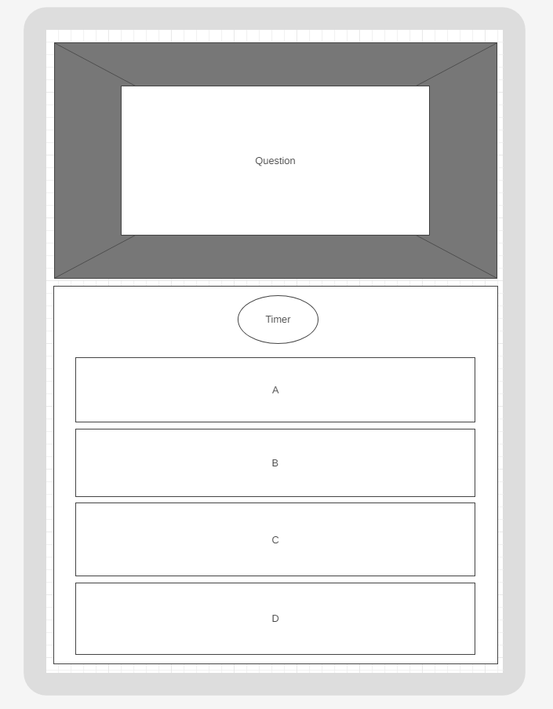

# Site Owner Goals

* To provide the user with an easy to navigate quiz game that is challenging whilst also not extensively time consuming.
* To present the user with a website that is visually appealing and fully responsive.
* To allow the user to test their general knowledge against a selection of randomly selected questions.
* To present the user with a quick thinking challenge whilst also not being too restricting.
* To tempt the user to come back and try again to get further and further along. 

# User Stories

## User Goals

### First Time User

* As a first time user I want to understand the main purpose of the quiz.
* As a first time user I want to be able to naavigate the quiz, understand the concept of the quiz, see how far I can get and restart the quiz should I fail.
* As a first time user I want to have fun and also expand my general knowledge.
  
### Returning User

* As a returning user I want to be able to play the same quiz and still enjoy it as much as the first time.
* As a returning user I want to be able to get further than the first time I attempted the quiz.

# Design

## Imagery and colour scheme

* The colour scheme of the site was given careful consideration. The colours used in the quiz is important to the overall experience of the user.
* The background of the site was chosen from a selection of images that relayed with how I wanted the quiz to look. Both images sourced from:
* https://www.freepik.com/free-vector/hand-drawn-question-mark-pattern_26373356.htm#query=question%20mark%20background&position=11&from_view=keyword&track=ais
* https://www.freepik.com/free-vector/hand-drawn-question-mark-pattern_26373361.htm#query=question%20mark%20background&position=15&from_view=keyword&track=ais
* Once the background image was chosen, it was important to make sure the quiz followed suit and so Blue and White became the two dominant colours.
* Making sure the image and the question and answers contrasted was important to make sure the accessibility for the user was always paramount, that is why there is large back backgrounds to take the focus off the background image.
  
## Layout

The quiz site is a single page with 3 sections:

* Welcome Area
* Play game
* How to play

## Initial Wireframes

Wireframes were designed on https://wireframe.cc
Markup : 

           
Computer Wireframe

           
         

Markup : 

            
iPad Wireframe

            
        

        
Markup : 

            
iPhone Wireframe

            

* Allow first time users to select a subsection of the quiz for something they enjoy more than a general quiz.
* Allow first time users to choose a mode of difficulty for the question bank.
* Allow the ability for first time/returning users to choose how long they want on the timer.
* Starting the quiz from a completely random point, and subsequent questions will be random, so the user won't do the quiz in the same order.
* Tracking the time it takes people to do the quiz. (Completions only)
* Having a local/non-local leaderboard to compare scores and see who did the quiz in the fastest time.
